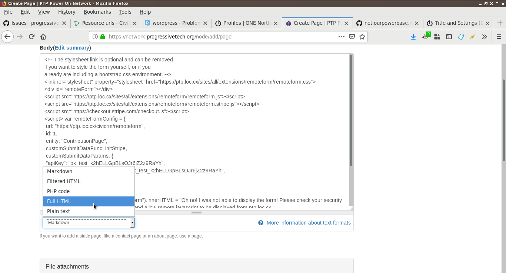
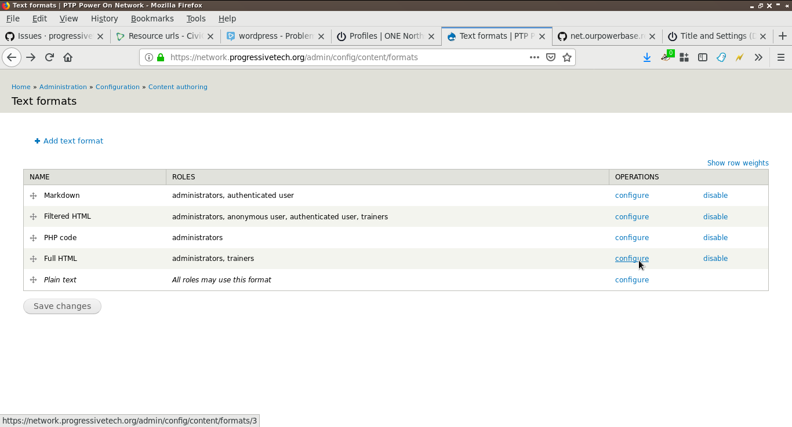
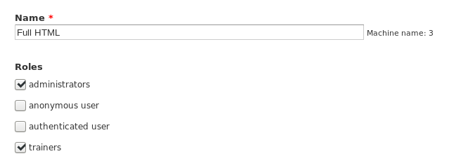

# Adding your code to a Drupal site

If you are running your main web site on Drupal, adding the remoteform
javascript is a breeze, *provided you have the proper permissions.*

If you do have the proper permissions, you can add the code to any page or
block. Simply paste the code into the available text box and then be sure to
change the text format to: Full HTML.

If you do not see the option to select Full HTML, then you will need to ensure
you have the right permissions.

## Setting permissions

To change permissions for the Full HTML option, click `Administration ->
Configuration -> Content Authoring -> Text Formats`.

Then, find the Full HTML option and click the link to configure it.

Lastly, select a role you are in or that you want to provide access.

